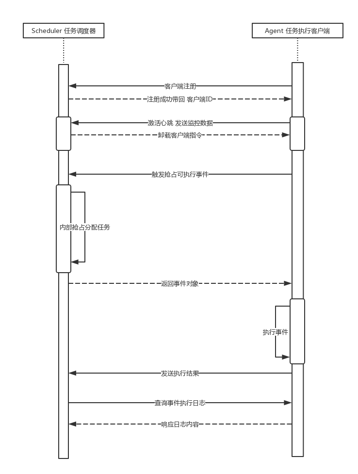

# radish

#### 项目介绍
分布式任务调度与系统监控服务

#### 软件架构
系统时序图

#### 安装教程

1. 下载source, 根据自己的Mysql环境和Redis环境修改配置文件, 并打包.
2. 初始化数据库
3. 配置好redis数据库
4. 启动scheduler服务端
5. 如有需要, 配置好网络环境, 在客户机上启动Agent客户端

#### 使用说明

1. 服务安装好后可以直接使用监控模块, 并内置支持Shell 和 Python脚本任务
2. 如有需要可以定制开发Agent, 参照SimpleHandler示例, 在service.handler包下自定义实例类,  
实例类必须继承AbsHandler抽象处理器, 同时必须添加@AHandler注解才能被服务端发现

#### 参与贡献

1. Fork 本项目
2. 新建 Feat_xxx 分支
3. 提交代码
4. 新建 Pull Request